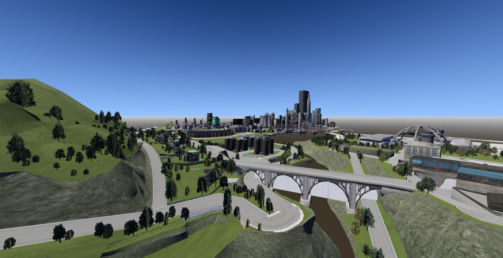
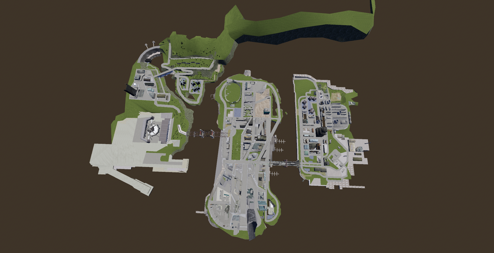
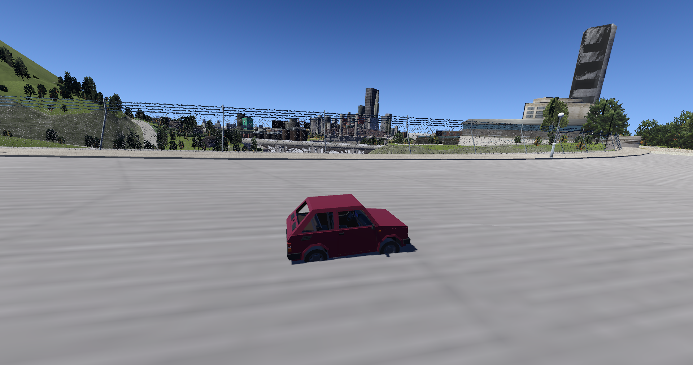
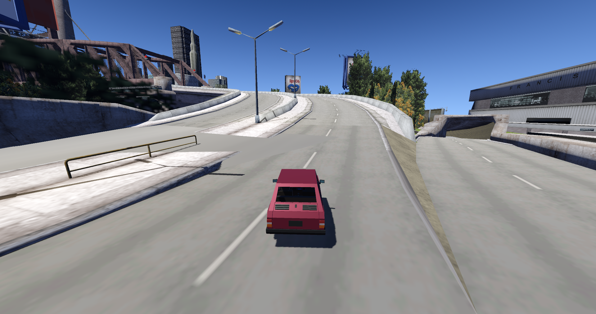
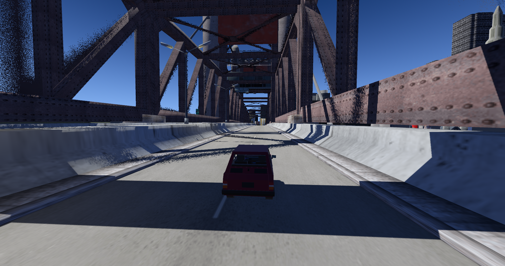
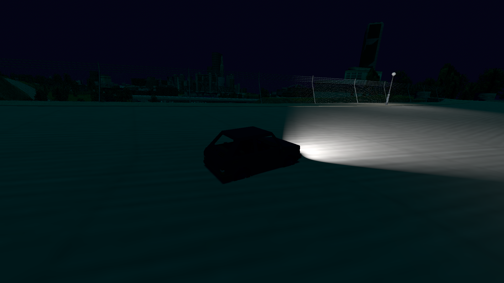
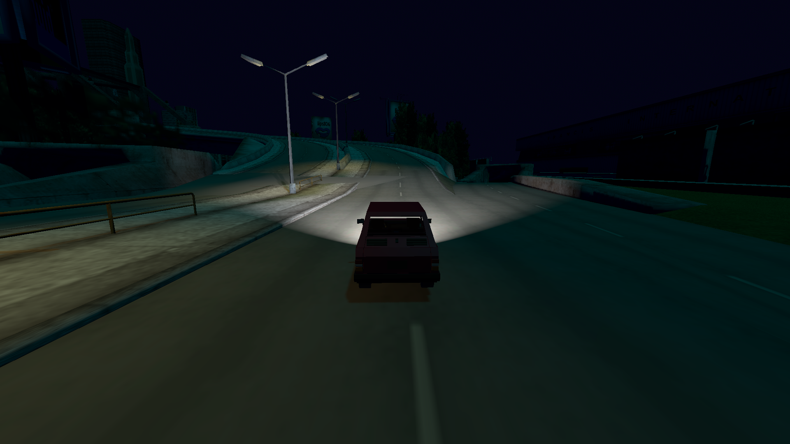
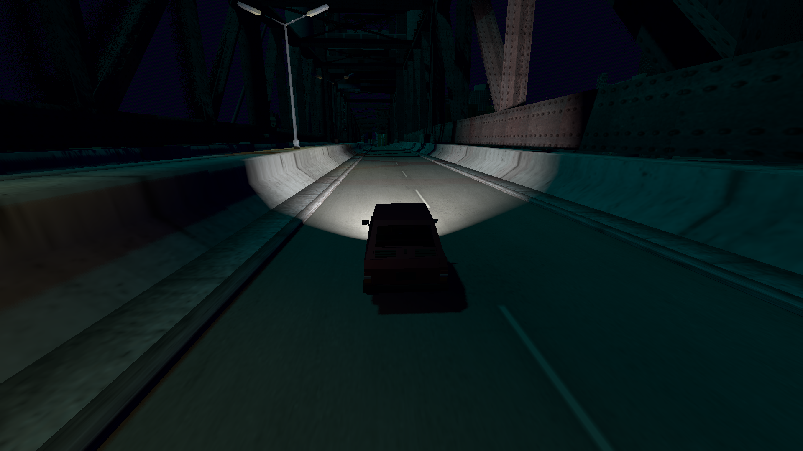

# OpenLiberty - GTA 3 in Godot

This project aims to reimplement the GTA 3 on the Godot Engine.

Currently, this project is able to load the game's map, collision data, etc. at
runtime and stream in models and textures as needed.

**This repository doesn't contain GTA3 code or files**

## What It Not Is?

It's not a 1:1 reimplementation because GTA3 is complex and old, the RenderWare formats needs to be converted to Godot which already is a lot of work.

The story mode is also very complex and time consuming to implement.

## How It Works?

The Godot engine loads the GTA3 files at execution by converting them from GTA3 file formats to Godot formats, this conversion is very fast and don't reduce performance.

## Motivation

Currently there's two open-source reimplementations of GTA3:

- [re3](https://github.com/halpz/re3) - It had legal problems due to Rockstar Games code.
- [OpenRW](https://openrw.org/) - Incomplete and not active.

Both projects use the [RenderWare](https://en.wikipedia.org/wiki/RenderWare) version of GTA3, which is old and limited for improvements.

Our project is more safe to work because we don't use Rockstar Games code, just the GTA3 files that the user needs to add on the project folder.

Beyond legal safety, the RenderWare version used on the GTA3 is old and technically limited for improvements. While the Godot Engine is modern and much more advanced, also easier to make contributions.

## Probable Future

If we successfully load most GTA3 formats, we could start a GTA San Andreas reimplementation on the Godot engine.

Why? because the GTA San Andreas formats are an evolution of the GTA3 formats, thus part of the GTA3 format converter code can be reused.

Similar to what the [San Andreas Unity](https://github.com/in0finite/SanAndreasUnity) project did, but the Unity engine is closed-source and proprietary.

## Why Godot?

The Godot engine allows you to save a lot of time in development because of the node system, where the relationship between the game components is very easily and fast to implement things.

Also because of GDScript, the Godot scripting language allows you to write less code to implement things.

## Screenshots










You can watch the demo video on [this](https://youtu.be/Z3Cd_NBYUfI?feature=shared) link.

## How To Run

### Godot Editor

- Download this repository
- Paste the GTA3 files inside the `gta` folder of the repository
- Open the Godot Engine and run the default scene

### Exported Executable

- Download this repository
- Open the Godot Engine
- Export the executable
- Paste the GTA3 files on the same folder of the executable

## Controls

- Arrow Keys/WASD - Move the player
- Z - Control the car headlights
- X - Control the internal car light
- Space - Play/Pause music
- = - Increase the music volume
- - - Decrease the music volume
- N - Enable the night
- F - Enable full-screen

## TODOs

- [ ] Properly verify if the GTA3 files are present before execution
- [ ] Configure the player model and texture on the map
- [ ] Load the vehicles
- [ ] Load the weapons
- [ ] Load the NPCs
- [ ] Load the animations
- [ ] Add controls on the player
- [x] Add controls on vehicles
- [ ] Configure the weapons
- [ ] Add Day and Night cycle
- [x] Add shadows
- [ ] Add rain
- [x] Add the Sun on the sky
- [ ] Add the Moon on the sky
- [ ] Support modding
- [ ] Multiplayer (WIP, almost working)

## Documentation

The most advanced and complete website for GTA documentation is the GTAMods Wiki, you can read it on [this](https://gtamods.com/wiki/Main_Page) link.

## Chat

- [Discord](https://discord.gg/d9ca4U64H4)
- [Matrix](https://matrix.to/#/#foss-supremacy:matrix.org)

## Bugs

If you want to send a bug report, open an issue with "(Bug)" before the title.

## Requests and Suggestions

### Features

If you have a feature request, open an issue with "(Feature request)" before the title.

### Suggestion

If you have a suggestion, open an issue with "(Suggestion)" before the title.

## How to Clone and Build

- Download the repository and game assets

```sh
git clone https://github.com/FOSS-Supremacy/re3-gd
```

- Download the [Godot Engine](https://godotengine.org/) 4.x version (normal variant, not C#)
- Export the executable to your operating system

## How To Contribute

- Give a star to this repository, it will increase our chances to receive contributions.
- Download the [Godot Engine](https://godotengine.org/) 4.x version (normal variant, not C#)
- Verify the open issues and select some item to work on
- Once ready, send a pull request (if you are adding commits on the PR branch, mark it as draft status)
- Send the link of your pull requests on the "Pull Requests" channel/room on [Discord](https://discord.gg/tk6Vnxv9Qt) or [Matrix](https://matrix.to/#/!vIwqjDewTZpciZqhEp:matrix.org?via=matrix.org).
- We don't accept C# code
- New assets needs to be licensed as Creative Commons
- **Don't distribute or send GTA3 files here, all PRs containing this will be closed, if the contributor do it again he/she will be banned from the repository**

## Donate

If you want to support our work, consider a donation, every amount is important.

- [Patreon](https://www.patreon.com/foss_supremacy)
- [Bitcoin](https://bitcoin.org)

```
bc1qg9x5vzr4ppkm2ssw5k7ete4lu49wg7t02azkce
```

## Credits

We thank [atirut-w](https://github.com/atirut-w) a lot for writting the GTA3 loader and configuring the project scenes, this project wouldn't be possible without his work.
